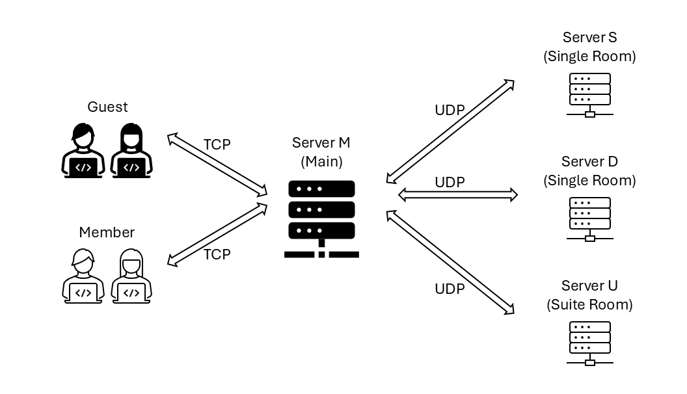

# Room Reservation System Overview
The room reservation system enables users to log in as either guests or members. Only members are authorized to make bookings, whereas both guests and members can check the availability of rooms. The system operates using TCP and UDP networking protocols.

  

## Files and Their Functions

- `client.cpp`: Provides a TCP client to connect with the TCP server (ServerM).
- `ServerM.cpp`: Acts as a TCP server for client connections and functions as both a UDP server and client.
- `ServerS.cpp`: Provides UDP server and client functionality.
- `ServerD.cpp`: Provides UDP server and client functionality.
- `ServerU.cpp`: Provides UDP server and client functionality.
- `file_reader.cpp`: Allows users to read a file by providing a path or organize data.
- `file_reader.h`: Header file for `file_reader.cpp`.
- `udp_connect.cpp`: Implements UDP client and server operations.
- `udp_connect.h`: Header file for `udp_connect.cpp`.

## User Authentication:

The client sends a string in the format: `"username\npassword\n"`. ServerM responds with:
- `"S"` — Success: the login is successful.
- `"failU"` — Failure (Username): the username was not found.
- `"failP"` — Failure (Password): the password is incorrect.

## Room Availability and Reservation:

**Client Requests**
- `"roomCode\nA\n"` — The client sends this to request **availability**.
- `"roomCode\nR\n"` — The client sends this to request a **reservation**.

**ServerM** may forward the request to **ServerS**, **ServerD**, or **ServerU** if necessary.

**Server Responses Status Codes(from ServerM/S/D/U):**
- `"PD"` — **Permission Denied**: The user does not have the required privileges.
- `"IA"` — **Invalid Availability**: The room code is invalid for an availability check.
- `"IR"` — **Invalid Reservation**: The room code is invalid for a reservation request.
- `"E"` — **Error**: A server-side error has occurred.
- `"A"` — **Available**: The room is available.
- `"N"` — **Not Available**: The room is not available.
- `"S"` — **Success**: The reservation was successful.
- `"F"` — **Failure**: The reservation failed.